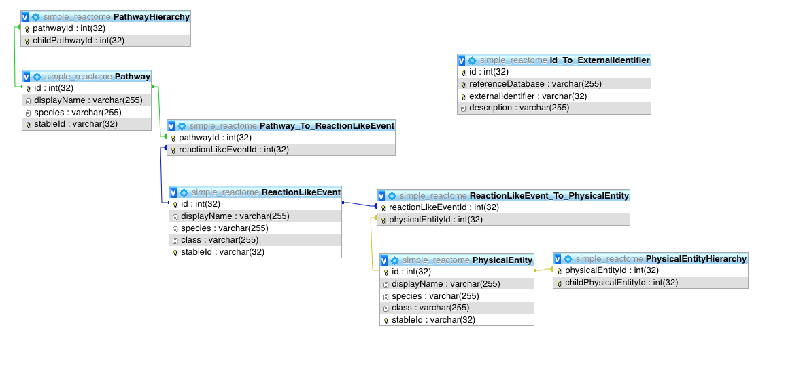

# Reactome-Simplified
# To Set up 

### Step I: unzip data folder
 
### Step II: install node packages

    `npm install`
    
### Step III: run code to popular mongoDB 

    `$ node process.js`
    
### Step IV: mongoDB 

- create database "reactome-simple"
- create Collections: "PathwayHierarchy", "PhysicalEntity", "ReactionLikeEvent_To_PhysicalEntity", "Pathways","ReactionLikeEvent", "Pathway_To_ReactionLikeEvent"

